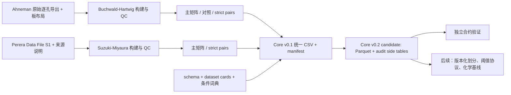

# 架构说明

## 目标与边界

CondRxnBench 将异构 HTE 原始证据转为可审计的、条件感知的评测数据。当前的 Core v0.1 只涵盖两套主矩阵与已枚举的严格单因素 pair；它不是完整 benchmark，且不把不同测量语义的绝对产率混为一谈。

## 层次与职责

| 层 | 位置 | 规则 |
| --- | --- | --- |
| 原始证据 | `data/raw/`、`data/raw_metadata/` | 固化来源、版本和校验；禁止用派生值覆盖 |
| 源数据重建 | `scripts/Buchwald-Hartwig-HTE/`、`scripts/Suzuki-Miyaura-HTE/` | 分别保持实验设计、控制与测量语义 |
| 源数据产物/QC | `data/processed/*`、`reports/` | 对照与主矩阵分离；缺失与观测零值分离 |
| Core 发布层 | `scripts/build_core_v0_1.py`、`data/processed/core_v0_1/` | immutable 统一基线，但不抹平来源语义 |
| Core v0.2 candidate | `scripts/build_core_v0_2.py`、`data/processed/core_v0_2/` | authoritative Parquet、CSV mirror 和 evidence side tables；不生成 benchmark 关系层 |
| 合约与验证 | `configs/`、`metadata/`、`tests/` | schema 定义语义，测试检查计数、主键、pair 不变量和 manifest |

## 关键不变量

- `not_reported` 表示未报告，不能解释为没有该成分；`NULL_COMPONENT` 表示来源中的显式 `None` 条件水平。
- 观测到的零产率与缺失产率不同；任何重建、划分或指标必须保留这一差别。
- strict pair 的端点在相同 `reaction_group_id`、相同数据源中，且 `n_changed_factors = 1`。
- 绝对产率结果必须按 `source_dataset` 与 `yield_type` 分层；跨源主分析优先使用组内相对条件效应。
- `success_label` 和 `cliff_label` 在 Core v0.1 均为 `not_assigned`，直到有版本化协议。

## 修改影响

- 改动原始映射或构建脚本：重跑源构建、QC、Core 构建和验证，并更新 dataset card/PROGRESS/CHANGELOG。
- 改动 Core 字段语义：先更新 schema 与数据字典，评估兼容性，必要时写 ADR。
- 新增数据源：先提供来源清单、许可证/可分发性判断、dataset card、重建脚本和 QC，再接入 Core。
