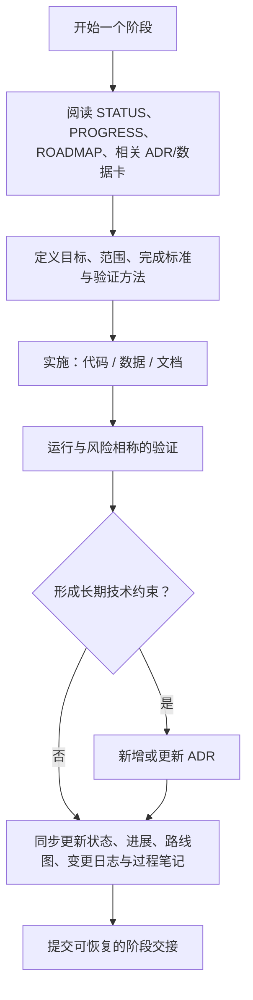

# 项目维护与阶段交接流程

本文件是 CondRxnBench 的**工作完成清单与交接协议**。无论由人还是 AI 完成一个阶段，都按本流程更新仓库，使下一位执行者只读仓库即可恢复上下文、判断可信边界并继续工作。

## 一句话原则

代码、数据、验证证据和文档必须同步变化；日常事实写进状态/进展，长期约束写进 ADR，下一步工作写进路线图。

## 维护体系的分工



| 文件/目录 | 何时更新 | 应写内容 | 不应写内容 |
| --- | --- | --- | --- |
| `STATUS.md` | 阶段完成、风险变化、当前焦点变化 | 当前阶段、可交付物、正在做、风险、恢复顺序 | 很长的历史叙述 |
| `PROGRESS.md` | 每个可验证阶段结束 | 已完成、新增、问题、下一步、验证结果 | 模糊的“继续优化” |
| `ROADMAP.md` | 优先级、范围或完成状态变化 | 未完成工作、优先级、完成标准 | 已完成阶段的细节 |
| `CHANGELOG.md` | 用户可见的数据/接口/行为改变 | 新增、修复、弃用；仅记录已发生变更 | 未验证的计划或预测结果 |
| `adr/` | 决定会长期影响数据语义、接口、架构或结论 | 背景、决策、原因、后果、状态 | 日常命令输出或工作流水账 |
| `notes/` | 每日工作或关键阶段 | 目标、证据、命令、结果、阻塞和下一步 | 密钥、令牌、受限原始内容 |
| `docs/`、`metadata/` | 设计、接口、schema 或数据语义改变 | 面向使用者的稳定说明和链接 | 未定结论或聊天记录 |

## 每个阶段的固定流程

### 1. 开始前：定义可验证目标

1. 阅读 `STATUS.md`，再阅读与任务相关的 `PROGRESS.md`、`ROADMAP.md`、ADR、dataset card 和 schema。
2. 在过程笔记中写清目标、范围、输入来源、预期产物、完成标准和验证命令。
3. 若任务会改变数据语义、评测规则或稳定接口，先写 `Proposed` ADR；未决定前不要把假设写成事实。

**开始模板：**

```md
# YYYY-MM-DD — 阶段标题

## 目标
- 要解决的问题：
- 范围（包含/不包含）：

## 完成标准
- [ ] 产物：
- [ ] 验证命令/人工检查：
- [ ] 文档同步：

## 输入与约束
- 来源、版本、许可证或数据语义：
- 已知风险：
```

### 2. 执行中：保留可复现证据

- 原始输入、派生数据和报告分层保存；不得用派生结果覆盖 `data/raw/`。
- 记录实际运行的命令、关键参数、随机种子、环境版本、输入/输出路径和失败原因。
- 对数据相关任务，明确区分 `NA`、`not_reported`、显式空条件和观测零值。
- 如果发现目标、风险或优先级实质变化，立即更新 `STATUS.md`，不要等到下一次交接。

### 3. 完成后：按顺序收尾

1. **验证**：运行与变更相称的测试、构建或人工审计；未运行则明确写“未验证”及原因，不能写成已完成。
2. **写过程笔记**：补充实际结果、验证输出、阻塞项和可执行的下一步。
3. **更新 `PROGRESS.md`**：新增一个日期阶段，填写“已完成 / 新增 / 问题 / 下一步”。
4. **更新 `STATUS.md`**：只保留最新快照；移除已不再当前的“正在进行”事项。
5. **更新 `ROADMAP.md`**：完成项打勾或移入进展；将新风险转为有完成标准的条目。
6. **更新 `CHANGELOG.md`**：若改变了用户可见数据、命令接口、schema 或兼容性，归入“新增 / 修复 / 弃用”。
7. **更新设计文档/ADR**：字段、接口或长期决策有变化时同步更新；ADR 一经 Accepted 不改写历史，应以新的 ADR 替代或补充。

## 阶段完成模板

将下列内容放入 `PROGRESS.md`，并以此更新其他文件。

```md
## YYYY-MM-DD — 阶段标题

### 已完成
- 具体结果与范围：

### 新增/变更
- 文件、接口、数据版本或行为：

### 验证
- 命令/检查：
- 结果：通过 / 未通过 / 未运行（说明原因）：

### 问题与风险
- 风险、限制、未验证项及其影响：

### 下一步
- [ ] 具体下一项（完成标准）：
```

## ADR 触发条件

满足任一条件就新建 ADR，而不是仅更新过程笔记：

- 改变数据的含义、来源处理方式、缺失值规则或测量比较边界；
- 固定评测划分、标签阈值、泄漏防护或指标口径；
- 引入/替换关键运行时、存储格式、数据层或公开接口；
- 选择一个会限制后续扩展、复现方式或结论解释的方案。

对 CondRxnBench，以下情况尤其需要 ADR：将新数据源接入 Core、给 `success_label`/`cliff_label` 赋值、改变 strict pair 定义、允许跨来源绝对产率比较、改变 schema 的兼容性。

## 提交前最小检查清单

- [ ] 变更范围与 `STATUS.md` 当前阶段一致。
- [ ] 验证已经运行，或未运行原因已明确记录。
- [ ] 产物能追溯到原始来源、版本和构建脚本。
- [ ] 数据语义/接口变化已同步到 schema、metadata、docs 和 changelog。
- [ ] 重要长期决策已有 ADR。
- [ ] `PROGRESS.md` 有阶段总结，`ROADMAP.md` 只保留未完成工作。
- [ ] 笔记不含凭证、令牌或不应分发的原始内容。

## 当前项目的推荐节奏

当前阶段是 Core v0.1 预发布。每次完成一个子阶段，应先运行相关构建与 `python3 tests/verify_core_v0_1.py`，再将验证结果写入过程笔记和 `PROGRESS.md`。涉及 benchmark split、success 阈值或 condition-cliff 阈值时，必须先写 ADR 和版本化配置，然后才能生成标签或报告模型结论。
